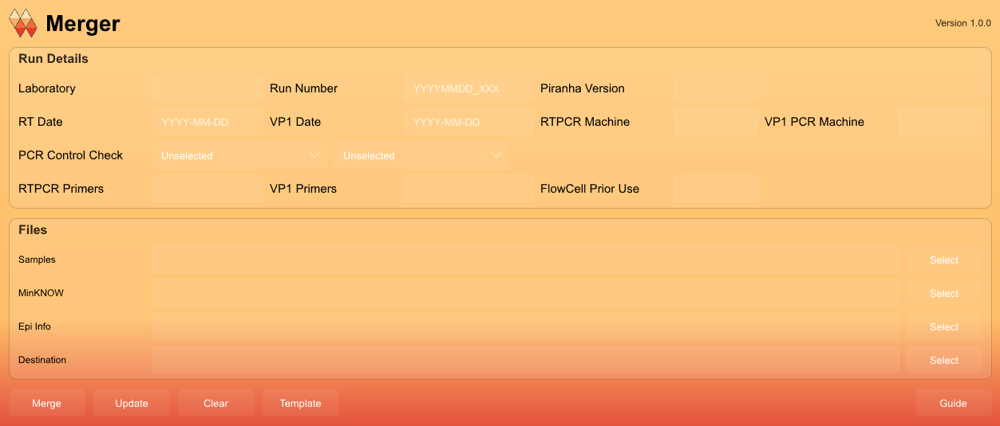

# Merger App

## Installation
The compiled executable can be found in the **releases** page. Note that the app is currently **Windows only**.

## Usage

### Overview
The Merger App allows users to merge lab and epidemiological (Epi) information into a detailed run report for input into Piranha. The app will also pull relevant information from a MinKNOW report when supplied.

## Input files
- A CSV version of the EpiInfo database.
- The sample template, which can be generated within the app. Please fill the sample and barcode columns before using merge.
- The minKNOW report from the sequencing run.

## Output
The app generates the `[Run Number]_barcodes.csv` at your chosen destination containing:
- Completed EpiInfo headers for each sample
- Run consistent details such as PCR machine, run number, Piranha version etc
- Run consistent details pulled from MinKNOW report such as MinKNOW software version, pores available, Flowcell ID etc

## General use
1. **Insert Run details**
   - The panel at the top contains input boxes for various fields that remain consistent for each sample in a run. Where a format is present in the box (e.g YYYYMMDD_XXX), inputs must match the format specified.

2. **Select Input Files**
   - Each input file should be selected individually using the 'select' buttons.
   - The `samples.csv` columns must match the template from protocols.io, or an error message will be displayed.

3. **Select Destination Directory**
   - Choose a directory where the merged output file will be saved.

4. **Merge CSVs**
   - Click the "Merge" button to initiate the merging process.
   - If errors occur, an error message will provide details on the issue.
   - The output at the chosen destination is used as input for Piranha.

5. **Generate Template Files**
   - With the template button, users can generate template files for `samples.csv` which contains all the headers present in the template from protocols.io.
  
6. **Update a detailed run report**
   - There is an option to provide an already completed detailed run report to be updated with EpiInfo details using the update button
  

There is a guide button available that provides information on what is expected for the input fields and also a short description of each button.
